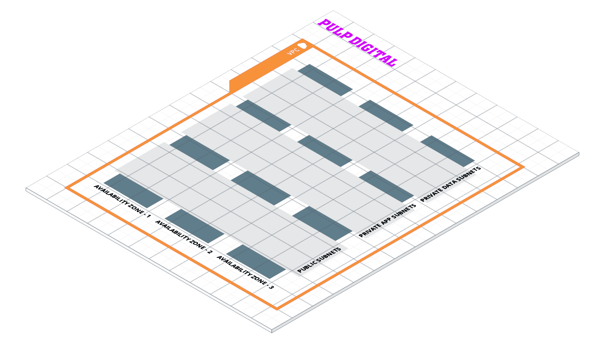

 

 
 
 

# AWS VPC Module from the Pulp Devops Library
This repository contains the [terraform](https://www.terraform.io/) configuration code that describes the [AWS](https://aws.amazon.com/) VPC Module from the Pulp DevOps Library.

## Quick start

## How to use this repo

Follow these steps to fully implement this repo:

#### Step #0 Github
If you are viewing this readme by any other means go to the canonical repository on [GitHub](https://github.com/pulp-digital-private/pulp-devops-library-iac-vpc-aws) for the most up to date version of this repo.

#### Step #1 //TODO
- //TODO
- //TODO

#### Step #2 //TODO
- //TODO
- //TODO

#### Step #3 //TODO
- //TODO
- //TODO

## Dependencies

To deploy this repo and make use of the supporting code samples you will need the following dependencies installed on your developer workstation and CICD host:
- [Terraform](https://www.terraform.io/): Use Infrastructure as Code to provision and manage any cloud, infrastructure, or service.
- [AWS CLI](https://aws.amazon.com/cli/): The AWS Command Line Interface (CLI) is a unified tool to manage your AWS services.
- [Go](https://golang.org/): Go is an open source programming language that makes it easy to build simple, reliable, and efficient software.

## Tooling

The following tools are not strictly required to work with this repo but we recommend their use and used them oursleves in the creation of this repo:
- [Github](https://github.com): GitHub is a development platform inspired by the way you work. From open source to business, you can host and review code, manage projects, and build software alongside 50 million developers.
- [AWS Cloud9 IDE](https://aws.amazon.com/cloud9/): A cloud-native IDE for writing, running, and debugging code. 
- [CloudCraft](https://cloudcraft.co/): Create a professional architecture diagram in minutes with the Cloudcraft visual designer, optimized for AWS with smart components.

## What's included with this repo?

The structure of this repo follows the conventions described by [terraform.io](https://www.terraform.io/docs/language/modules/develop/structure.html).

This repo has the following folder structure:

- [test](/test): A suite of automated tests for this repo.
- [examples](/examples): Examples of how to use and implement the contents of this repo to deploy infrastructure as code.

## Who maintains this repo?

This repo is maintained by Pulp Digital Engineering. If you're looking for support, send an email to [engineering@pulpdigital.com](mailto:engineering@pulpdigital.com?subject=DevOps%20Library%20VPC%20AWS).
Core Engineering can help with:

- Setup, customization, and support for this repo.
- Modules for other types of infrastructure, such as VPCs, Docker clusters, databases, and continuous integration.
- Modules that meet compliance requirements, such as HIPAA.
- Consulting & Training on AWS, Terraform, and DevOps.

## How do I contribute to this repo?

Contributions are welcome. Check out the
[Contribution Guidelines](/CONTRIBUTING.md) and 
[Code of Conduct](/CONDUCT.md) for instructions.

## How is this repo versioned?

This repo follows the principles of [Semantic Versioning](http://semver.org/). You can find each new release,
along with the changelog, in the [Releases Page](../../releases).

During initial development, the major version will be 0 (e.g., `0.x.y`), which indicates the code does not yet have a
stable API. Once we hit `1.0.0`, we will make every effort to maintain a backwards compatible API and use the MAJOR,
MINOR, and PATCH versions on each release to indicate any incompatibilities.

Publication of the CHANGELOG for this repo is automated using [git-changelog](https://github.com/git-chglog/git-chglog).

## Architectural Decisions

All architectural decisions made in the authoring of this repo are captured as a log of [Architecture Decision Records](http://thinkrelevance.com/blog/2011/11/15/documenting-architecture-decisions) (ADRs). This log can be found in the [_adr](/_adr) sub directory of this repo.

Creation of architecural decision records relating to this repo is automated using [adr-tools](https://github.com/npryce/adr-tools).

## License

This code is released under the Apache 2.0 License. Please see
[LICENSE](/LICENSE) and
[NOTICE](/NOTICE) for more details.

Copyright &copy; 2021 https://pulpdigital.com